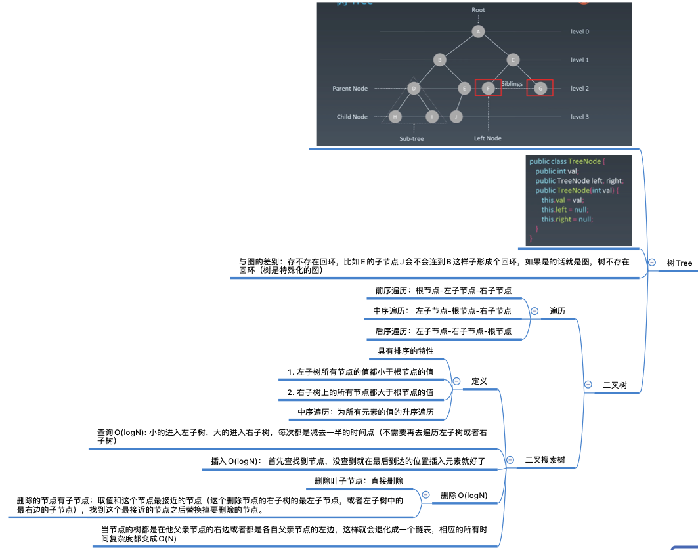
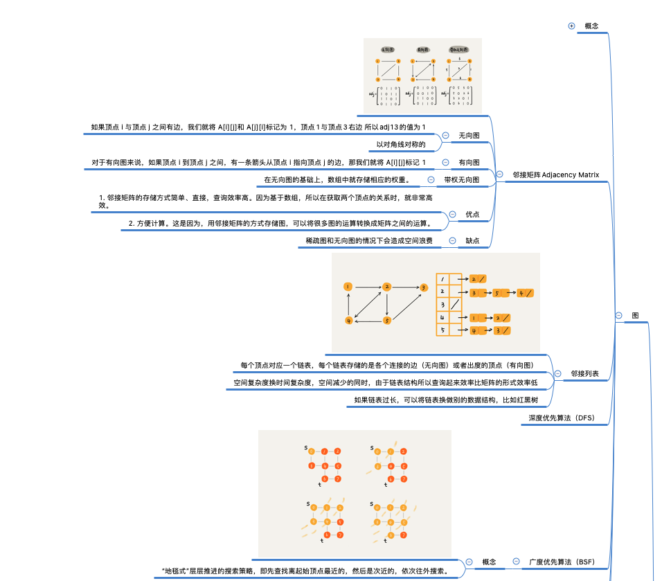

学习笔记

第二周：

## 递归	

 	1.  终止条件-> 终止时的返回语句 （递归什么时候结束，结束要返回什么给前面）
 	2.  逻辑处理代码（递归的同时必要的判断，循环）
 	3.  向后递归语句（怎么向后递归）
 	4.  变量的处理以及方法的返回值。

## 树

## 堆

## 图

*如果看不了图片，请前往文件夹根目录下的/images文件夹查看本周的脑图笔记 ！*

