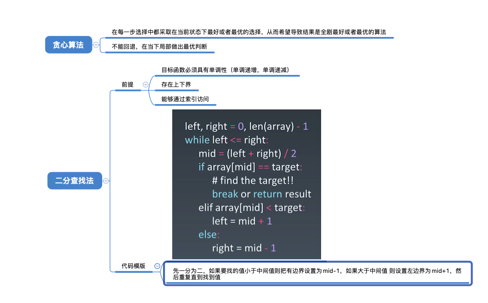
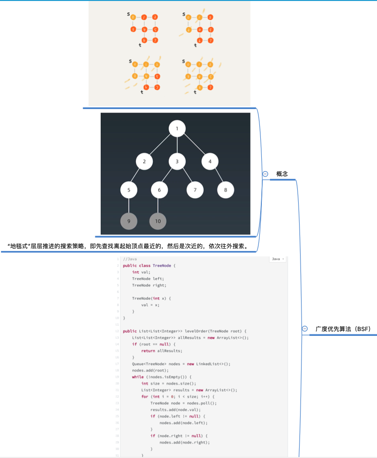
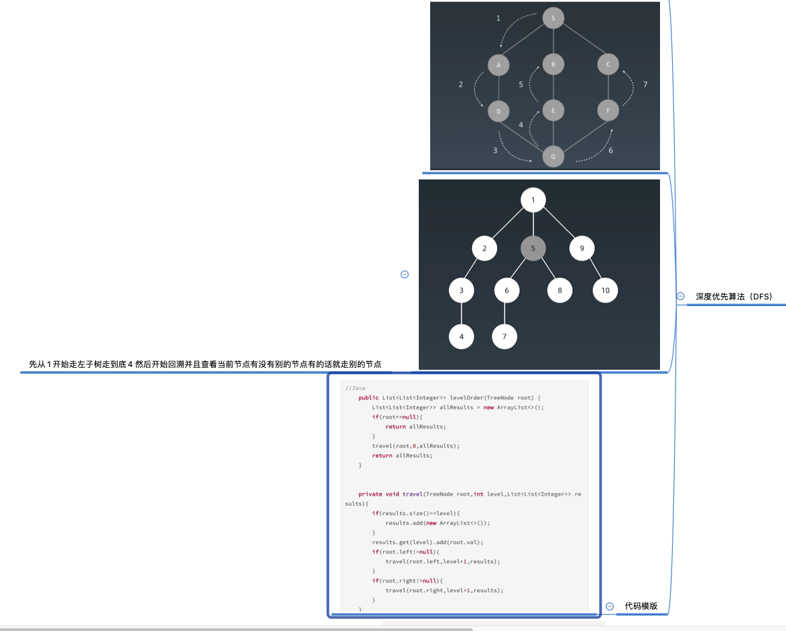

## 本周题目

使用二分查找，寻找一个半有序数组 [4, 5, 6, 7, 0, 1, 2] 中间无序的地方。

~~~java
//二分查找+递归
public void getDivergencePoint( int ans,int left,int right) {
        mid=(left+right)>>1;
        //如果mid两边的数字同时大于或者小于mid就找到了分歧点并且返回
        if (mid+1<mid && mid-1<mid) {ans=mid+1; return;}
        if (mid+1>mid && mid-1>mid) {ans=mid-1; return;}
        //没有分歧点
        if (left==right) { ans=-1;return;}
        
        getDivergencePoint(ans,mid+1,right);
        getDivergencePoint(ans,left,mid-1);
}
~~~

## 本周脑图

## 本周学习感想

这一周感觉难度上去挺多的，有好多题目一下子不能马上理解就反复看超哥的视频，代码量也相应增大。 加油！