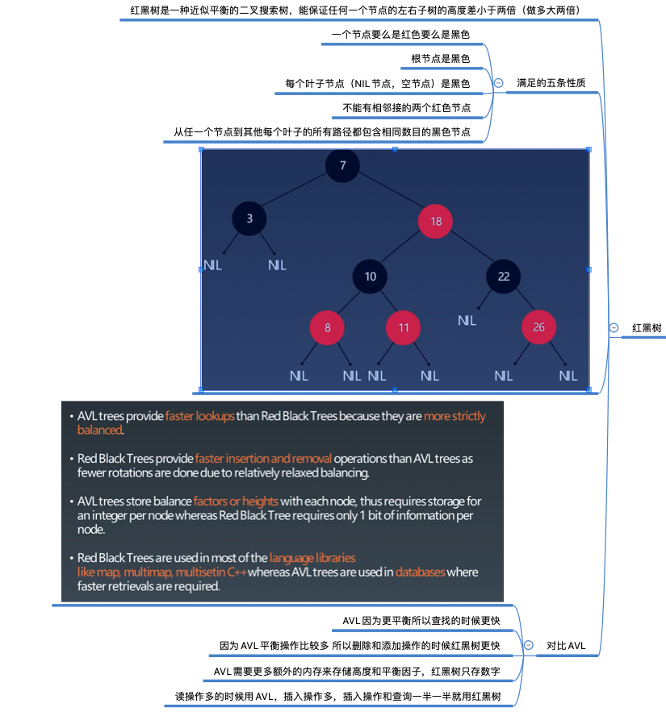

本周学习笔记

1. 分析“单词搜索 II”用 Tire 树实现的时间复杂度

   ~~~
       board.row.length->R  board.col.length->C  average length of each word->K
   
       每一格的起始启动步数为 4*3^(K-1):
       刚开始的时候第一次可以探索4格(一开始不存在探索过的格子)，之后每次可以探索3格（排除掉了之前探索过的一格），k-1：减去之前找到的那个字母
       在此基础上乘以单元格的总格子数 R*C
       最终时间复杂度：（R*C）* (4*3^(K-1))
   ~~~

   

2. 总结双向 BFS 代码模版

   ~~~
   伪代码： 从头和尾开始向中间广度优先一层一层推进，如果发觉一个值存在于另外一个遍历的level层级的结果中就说明找到了
   
   	HashSet<T>begin, end;				//定义两个set一个存放头开始的广度优先遍历中一个level的值，一个存放尾开始的.....
   	
   	if (begin.size>end.size) {exchange begin and end} // 如果begin大于end 就交换两个set，总是遍历小的那个																												//	set，因为小的set遍历的时间短
   	
   	bfs(begin); --> if (T t in end ) {return true;} // 遍历过程中如果遍历到一个end中存在的东西则说明找到了
   	
   ~~~

3. Trie笔记

   

4. AVL笔记

   

5. 红黑树笔记

   

6. 并查集笔记

   

   

