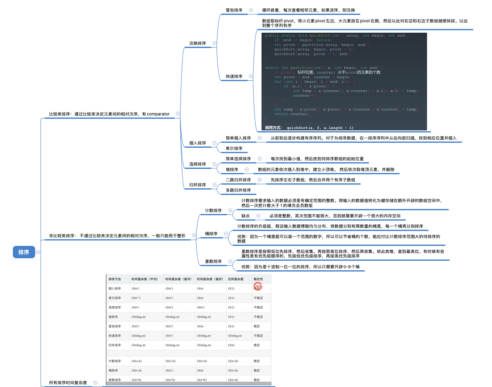
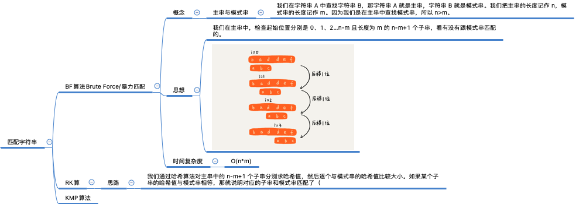

# 笔记

## 初级排序代码实现

```java
/**
 * @Author: Andrew Lu
 * @Description: 冒泡排序
 */
public class BubbleSort {

    /**
     * O(N^2)
     * @param nums
     * @return
     */
    public int [] bubbleSort( int [] nums) {
        boolean flag=false;
        for (int i=0; i<nums.length; i++) {
            flag=false;
            //nums.length-i: 排除掉已经排好序的元素
            //nums.length-i-1: 最后一个元素不需要遍历因为j+1会查到他
            for (int j=0; j<nums.length-i-1; j++) {
                if (nums[j]>nums[j+1]) {
                    //交换
                    int temp=nums[j];
                    nums[j]=nums[j+1];
                    nums[j+1]=temp;
                    //性能优化
                    flag=true;
                }
            }
            //如果这一轮都没修改过，说明目前的数组已经是有序的就直接break出循环
            if(!flag) {
               break;
            }
        }
        return nums;
    }

    public static void main(String[] args) {
        BubbleSort b=new BubbleSort();
        int[] result=b.bubbleSort(new int[]{1,9,5,2,3});
        for (int num: result) {
            System.out.println(num);
        }
    }
}
```


```java
/**
 * @Author: Andrew Lu
 * @Description: 插入排序
 */
public class InsertSort {


    // 插入排序，a表示数组，n表示数组大小
    public int[] insertSort(int[] nums) {
        for (int i = 1; i < nums.length; ++i) {
            int value = nums[i];
            int j = i - 1;
            // 查找已排序区域的插入的位置
            for (; j >= 0; --j) {
                if (nums[j] > value) {
                    //找到插入位置后原来的数据往前移动数据移动
                    nums[j+1] = nums[j];
                } else {
                    break;
                }
            }
            // 插入数据
            nums[j+1] = value;
        }
        return nums;
    }

    public static void main(String[] args) {
        InsertSort i =new InsertSort();
        int[] result=i.insertSort(new int[]{1,9,5,2,3});
        for (int num: result) {
            System.out.println(num);
        }
    }
}
```


```java
**
 * @Author: Andrew Lu
 * @Description 选择排序
 */
public class SelectionSort {

    public int[]  selectionSort(int [] nums) {
        for (int i=0; i<nums.length; i++) {
            int min=i;
            for (int j=i+1; j<nums.length; j++) {
                min= nums[min] > nums[j] ? j : min;
            }
            //交换 把最小值放到本次循环的最前面
            int temp = nums[i];
            nums[i] = nums[min];
            nums[min] = temp;

        }
        return nums;
    }

    public static void main(String[] args) {
        SelectionSort i =new SelectionSort();
        int[] result=i.selectionSort(new int[]{1,9,5,2,3});
        for (int num: result) {
            System.out.println(num);
        }
    }
}
```


```java
/**
 * @Author: Andrew Lu
 * @Description: 快速排序
 */
public class QuickSort {
    public void quickSort(int [] array,int begin, int end) {
        if (end<=begin) {return;}
        int pivot=partition(array,begin,end);
        quickSort(array,begin,pivot-1);
        quickSort(array,pivot+1,end);
    }

    /**
     *  将pivot定义为最后一个元素下表，counter则是从第一个开始，碰到比array[pivot]小的，就放到counter位置，counter++，
     *  这样一次循环下来 可以把 所有小于array[pivot]的数放在pivot的左边，大于array[pivot]的数放在pivot的右边
     * @param array
     * @param begin
     * @param end
     * @return
     */
    private int partition(int[] array, int begin, int end) {
        int pivot=end;
        //小于pivot的元素的个数
        int counter=begin;
         for (int i=begin; i<end; i++) {
             //如果当前元素比 pivot下标元素小
             if (array[i]<array[pivot]) {
                 //当前元素array[i]和array[counter]交换位置
                 int temp=array[counter];
                 array[counter]=array[i];
                 array[i]=temp;

                 counter++;
             }
         }
         //最后counter的位置就是pivot的位置 比counter小的元素都在pivot左边，大的都在右边
         int temp = array[pivot];
         array[pivot] = array[counter];
         array[counter] = temp;
         return counter;

    }
}
```


## 学习笔记截图




